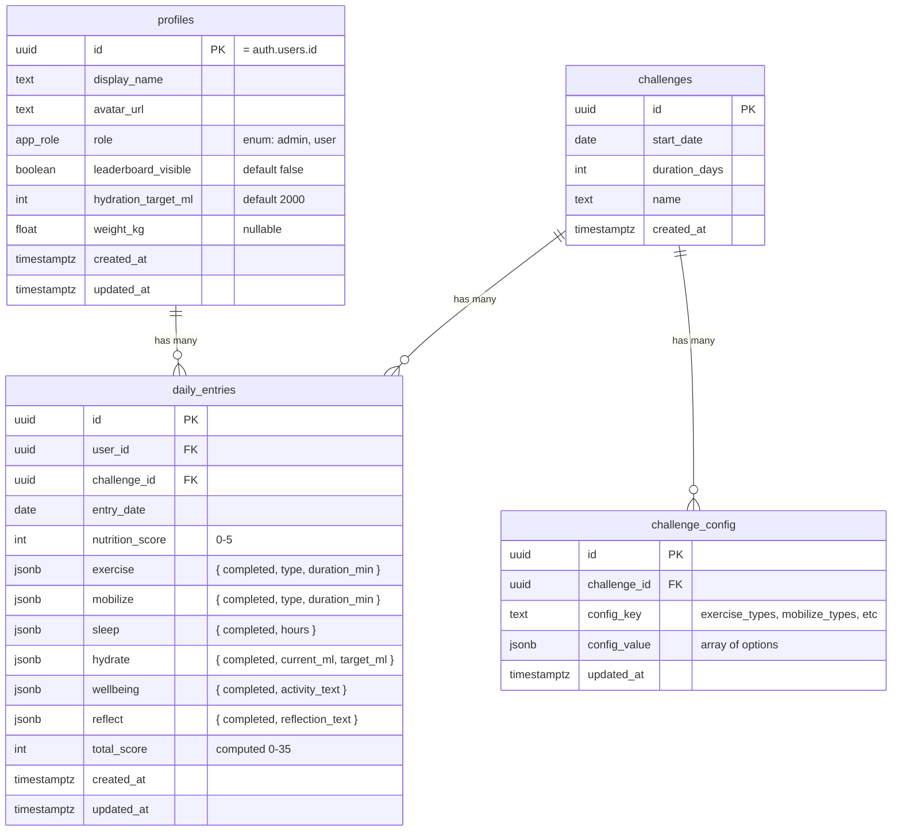

# feat: Multi-User Whole Life Challenge Tracker v2

## Overview

Transform the existing single-user, localStorage-based Whole Life Challenge tracker into a multi-user authenticated application with Supabase backend, enhanced habit tracking, admin configuration, charting enhancements, an info/resources page, and a future path to Apple Health integration.

The app tracks 7 daily habits (Nutrition, Exercise, Mobilise, Sleep, Hydrate, Well-Being, Reflect) across a 42-day challenge (Apr 11 - May 22, 2026). Max daily score is 35, max challenge score is 1,470.

## Problem Statement

The v1 app is a single-component React SPA with localStorage persistence. It works for one person in one browser. The target users are a group of people doing the challenge together who want to:

1. Track their own habits with richer data than simple toggles
2. See how they're doing relative to each other (opt-in)
3. Have an admin configure exercise/mobilise types and hydration targets
4. Access WLC educational resources from within the app
5. Eventually pull data from Apple Health/Watch

## Proposed Solution

### Technology Stack

| Layer | Technology | Rationale |
|-------|-----------|-----------|
| **Frontend** | Vite + React 19 (existing) | Already deployed to Vercel |
| **Routing** | React Router v7 | Needed for auth gates, admin routes, info page |
| **Auth** | Supabase Auth (Google OAuth) | Single platform for auth + database; PKCE flow for SPA security |
| **Database** | Supabase (Postgres) | RLS for per-user isolation; SQL for leaderboard queries; JSONB for admin config |
| **Real-time** | Supabase Realtime | Live leaderboard updates |
| **Charts** | Recharts 3.x (existing) | Already in use; supports all planned chart types |
| **Export** | PapaParse (CSV) + @react-pdf/renderer (PDF) | Client-side export, no server needed |
| **Deployment** | Vercel (existing) | Already deployed at whole-life-challenge.vercel.app |

### Why Supabase over Firebase

- Google Auth setup is ~3 steps (OAuth Client ID in GCP Console, paste into Supabase dashboard, call `signInWithOAuth`)
- User data lives in Postgres, joinable with app tables via standard SQL -- no separate profile sync
- Row Level Security enforces data isolation at database level, not application level
- Leaderboard queries use `RANK()` window functions -- no denormalization needed
- Custom JWT claims for admin RBAC without a separate authorisation service
- Free tier: unlimited API requests, unlimited auth users, 500MB database

## Technical Approach

### Architecture

```
┌─────────────────────────────────────────────────┐
│                   Vercel (CDN)                   │
│            Vite + React 19 SPA                   │
│                                                  │
│  ┌──────────┐ ┌──────────┐ ┌──────────────────┐ │
│  │ Auth Gate │ │  Router  │ │  State (Context)  │ │
│  └────┬─────┘ └────┬─────┘ └────────┬─────────┘ │
│       │             │                │            │
│  ┌────▼─────────────▼────────────────▼─────────┐ │
│  │              Supabase Client                 │ │
│  └──────────────────┬──────────────────────────┘ │
└─────────────────────┼────────────────────────────┘
                      │ HTTPS / WebSocket
┌─────────────────────▼────────────────────────────┐
│               Supabase Platform                   │
│                                                   │
│  ┌────────────┐  ┌──────────────┐  ┌───────────┐ │
│  │  Auth       │  │  Postgres    │  │ Realtime  │ │
│  │  (Google    │  │  + RLS       │  │ (leader-  │ │
│  │   OAuth)    │  │  + RPC       │  │  board)   │ │
│  └────────────┘  └──────────────┘  └───────────┘ │
└───────────────────────────────────────────────────┘
```

### Database Schema (ERD)



### Row Level Security Policies

- `daily_entries` SELECT/INSERT/UPDATE/DELETE: `auth.uid() = user_id`
- `daily_entries` SELECT (leaderboard): via RPC function that only returns `display_name` + `total_score` for users where `leaderboard_visible = true`
- `challenge_config` SELECT: all authenticated users
- `challenge_config` INSERT/UPDATE/DELETE: users with `role = 'admin'` only
- `profiles` SELECT own: `auth.uid() = id`
- `profiles` SELECT others: only `display_name`, `avatar_url` where `leaderboard_visible = true`
- `profiles` UPDATE: `auth.uid() = id`

### Data Model Migration (localStorage to Supabase)

On first authenticated load, check for `wlc-data` in localStorage:

```
existing: { exercise: true }
migrated: { exercise: { completed: true, type: "Other" } }

existing: { hydrate: true }
migrated: { hydrate: { completed: true, current_ml: target_ml, target_ml: target_ml } }

existing: { sleep: true }
migrated: { sleep: { completed: true, hours: null } }

existing: { wellbeing: true }
migrated: { wellbeing: { completed: true, activity_text: "" } }

existing: { reflect: true, reflection: "some text" }
migrated: { reflect: { completed: true, reflection_text: "some text" } }
```

After successful migration to Supabase, clear localStorage keys.

### Scoring Rules (Updated)

| Habit | Score 5 | Score 0 |
|-------|---------|---------|
| Nutrition | Start at 5, deduct 1 per non-compliant food (unchanged) | All 5 deducted |
| Exercise | Any activity type selected = completed | Not logged |
| Mobilise | Any activity type selected = completed | Not logged |
| Sleep | Hours logged (any amount = completed) | Not logged |
| Hydrate | current_ml >= target_ml | current_ml < target_ml |
| Well-Being | Activity text entered | Not logged |
| Reflect | Reflexion text entered | Not logged |

**Max daily: 35. Max challenge: 1,470.** Scoring remains binary 5/0 per habit to preserve compatibility with the WLC official format.

### Component Decomposition

Current: 1 file, 488 lines, all inline styles.

Proposed structure:

```
src/
├── main.jsx
├── App.jsx                      # Router + AuthProvider + Supabase client
├── lib/
│   ├── supabase.js              # Supabase client singleton
│   ├── scoring.js               # scoreDay, streak calculation
│   └── dates.js                 # Date utilities (getDayIndex, formatDate, etc)
├── contexts/
│   ├── AuthContext.jsx           # Auth state, user profile, role
│   └── ChallengeContext.jsx     # Challenge config, shared state
├── components/
│   ├── AuthGate.jsx             # Login screen + Google OAuth button
│   ├── RequireRole.jsx          # Route guard for admin
│   ├── Layout.jsx               # Nav bar + page shell
│   ├── habits/
│   │   ├── NutritionCard.jsx    # Deduction counter (unchanged)
│   │   ├── ExerciseCard.jsx     # Dropdown + completion
│   │   ├── MobilizeCard.jsx     # Dropdown + completion
│   │   ├── SleepCard.jsx        # Hours input
│   │   ├── HydrateCard.jsx      # +250ml increment buttons + progress bar
│   │   ├── WellbeingCard.jsx    # Card + modal trigger
│   │   └── ReflectCard.jsx      # Card + modal trigger
│   ├── modals/
│   │   ├── WellbeingModal.jsx   # Free-text activity entry
│   │   └── ReflectModal.jsx     # Free-text reflection entry
│   ├── charts/
│   │   ├── DailyScoreChart.jsx  # Area chart (existing)
│   │   ├── CumulativeChart.jsx  # Running total line chart (NEW)
│   │   ├── HabitBarChart.jsx    # Per-habit bar breakdown (NEW)
│   │   ├── HabitHeatmap.jsx     # GitHub-style grid (existing)
│   │   ├── StreakDisplay.jsx    # Per-habit streak counters (NEW)
│   │   └── WeeklyTotals.jsx     # Progress bars (existing)
│   ├── comparison/
│   │   ├── LeaderboardToggle.jsx # Opt-in visibility switch
│   │   └── ComparisonView.jsx   # Multi-user overlay charts
│   └── export/
│       ├── ExportCSV.jsx        # PapaParse unparse + download
│       └── ExportPDF.jsx        # @react-pdf/renderer summary
├── pages/
│   ├── CheckIn.jsx              # Daily habit check-in (main view)
│   ├── Progress.jsx             # Charts + comparison
│   ├── Journal.jsx              # Reflections timeline
│   ├── Info.jsx                 # WLC resources + blog links
│   └── Admin.jsx                # Exercise/mobilize types + config
└── styles/
    └── theme.js                 # Color tokens, font references
```

### Admin Console

**Access:** Users with `role = 'admin'` in their profile see an "Admin" tab in the nav.

**Configurable items:**
- Exercise activity types (array of strings, e.g., ["Running", "Swimming", "Weights", "Yoga", "CrossFit", "Cycling"])
- Mobilise activity types (array of strings, e.g., ["Stretching", "Yoga", "Foam Rolling", "Massage", "Pilates"])
- Default hydration target (ml) -- users can override on their profile

**Mid-challenge changes:** Soft delete pattern. Removing an option from the dropdown hides it for future entries but preserves historical data that references it. The dropdown shows active options; past entries display whatever was selected at the time.

**Initial admin assignment:** First user to sign up gets admin role, OR specified via an environment variable (`VITE_ADMIN_EMAIL`). Additional admins can be promoted by existing admins via the admin console.

### Enhanced Habit Tracking Details

**Exercise & Mobilise Dropdowns:**
- Tap habit card -> dropdown appears inline (not a separate page)
- Select activity type -> card marks as complete with the selected type shown
- Activity types sourced from `challenge_config` table (admin-managed)
- Optional: duration field (minutes) for additional tracking

**Sleep:**
- Tap sleep card -> numeric input appears for hours (supports 0.5 increments)
- Any hours logged = completed (5 points)
- Display shows hours logged on the card after entry

**Hydrate:**
- Card shows progress bar: `current_ml / target_ml`
- +250ml button on the card (tap multiple times throughout day)
- Auto-marks complete when `current_ml >= target_ml`
- Target configurable: default from admin config, overridable per user in profile
- Undo button to remove last 250ml increment

**Wellbeing & Reflect Modals:**
- Tap card -> modal slides up with a textarea
- Wellbeing: "What did you do for your well-being today?"
- Reflect: "How did today go?" (replaces current inline textarea)
- Save button closes modal and marks habit complete
- Minimum character count: none (any entry counts)

### Charting Enhancements

**1. Per-Habit Streak Tracking (NEW)**
- Calculate consecutive days each individual habit was completed
- Display as a row of streak counters below the stats row on Check In view
- Visual: coloured number badges per habit (e.g., "Exercise: 5 days")
- Calculation: iterate backwards from today, count consecutive completed days per habit

**2. Cumulative Score Chart (NEW)**
- Line/area chart showing running total score over 42 days
- X-axis: day number, Y-axis: cumulative score (0 to 1,470)
- Include a "perfect pace" reference line (35 * day_number)
- Helps users see if they're on track overall

**3. Per-Habit Bar Chart Breakdown (NEW)**
- Stacked or grouped bar chart showing points per habit per day/week
- Colour-coded by habit (using existing colour scheme)
- Useful for identifying which habits are being dropped
- Toggle between daily and weekly view

**4. Export/Summary View (NEW)**
- **CSV Export:** All daily entries as a downloadable CSV (date, each habit status, daily score)
  - Library: PapaParse `unparse()`
  - Trigger: "Export CSV" button on Progress page
- **PDF Summary:** Formatted report with overall stats, charts, and reflections
  - Library: `@react-pdf/renderer`
  - Includes: total score, completion rate, per-habit stats, best/worst weeks
  - Trigger: "Download Summary" button on Progress page

### Comparison / Leaderboard

**Privacy model: opt-in sharing.**
- Default: users are NOT visible to others
- Toggle on profile: "Show my progress on the leaderboard"
- Leaderboard only shows: display name, daily score, total score, streak
- **Never shared:** reflections, nutrition details, specific habit details
- Users can toggle viewing others' data on/off on the Progress page

**Implementation:**
- Supabase RPC function `get_leaderboard(challenge_id)` returns aggregated scores for opted-in users
- Uses `DENSE_RANK()` window function for ranking
- Realtime subscription on leaderboard updates for live scores
- Chart overlay: other users' cumulative scores as faded lines on the cumulative chart

### Info / Resources Page

**Structure:** Categorised links to WLC blog articles, organised by habit area.

**Categories:**
- **Exercise & Fitness** - HIIT guides, bodyweight workouts, kettlebell basics, functional fitness
- **Mobility & Flexibility** - Stretching routines, yoga modifications, posture exercises
- **Nutrition & Recipes** - WLC-compliant recipes, meal prep guides, dietary guidance
- **Sleep** - Sleep hygiene, supplements, impact of sleep deprivation
- **Hydration** - Mental health & cognitive performance benefits
- **Well-Being & Mindset** - Mindfulness, habit formation, discipline, vulnerability
- **WLC-Specific** - How to play the challenge, off-season skill practices, scoring guide

**Content:** Curated selection of ~30-40 top articles from the WLC blog (full list of 108+ articles available from research). Links open in new tabs. Hardcoded initially; admin-editable in a future version.

**Key articles to feature:**
- Healthcare is broken (and how to fix it) - https://www.wholelifechallenge.com/healthcare-is-broken-and-how-to-fix-it/
- The Power of Small Habit Change - https://www.wholelifechallenge.com/the-power-of-small-habit-change-building-a-better-you-one-step-at-a-time/
- Mobility vs. Flexibility Guide - https://www.wholelifechallenge.com/mobility-vs-flexibility-the-ultimate-guide-to-staying-active-and-independent-as-you-age/
- The Role of Hydration in Mental Health - https://www.wholelifechallenge.com/the-role-of-hydration-in-mental-health-and-cognitive-performance/
- Mental Health and Nutrition - https://www.wholelifechallenge.com/mental-health-and-nutrition-how-diet-impacts-mood-anxiety-and-cognitive-function/
- HIIT for Busy Schedules - https://www.wholelifechallenge.com/high-intensity-interval-training-hiit-for-busy-schedules-the-ultimate-guide-for-professionals/
- Move Your Body in 10 Minutes - https://www.wholelifechallenge.com/move-your-body-in-only-10-minutes-no-gym-no-stress-all-sweat/
- 6 Simple Tips for Creating New Habits - https://www.wholelifechallenge.com/6-simple-tips-for-creating-new-habits-that-actually-last/
- How to Play the WLC When You're Sick - https://www.wholelifechallenge.com/how-to-play-the-whole-life-challenge-when-youre-sick/
- The End of the WLC: Now What? - https://www.wholelifechallenge.com/the-end-of-the-whole-life-challenge-now-what/

### Apple Health Integration (Deferred to v2)

**Verdict: Not feasible for the web app.** HealthKit is a native iOS framework with no web API. A Vite SPA served from Vercel cannot access HealthKit data.

**Future path (v2):**
1. Wrap the React app with **Capacitor** to produce a native iOS binary
2. Use `@capgo/capacitor-health` or `@perfood/capacitor-healthkit` plugin
3. Readable data: Exercise workouts (type, duration, calories), Sleep sessions (hours, stages)
4. **Water intake is NOT supported** by any major Capacitor HealthKit plugin -- would require a custom plugin or fork
5. Requires Apple Developer account ($99/year), App Store submission, privacy nutrition labels
6. Two deployment targets: Vercel (web) + App Store (iOS with HealthKit)

**Recommendation:** Ship the web app as v2 first. Gather user feedback on which HealthKit data would be most valuable. Build the Capacitor wrapper as v3 if there's demand.

## Implementation Phases

### Phase 1: Foundation (Backend + Auth + Component Decomposition)

**Goal:** Get Supabase running, users signing in, data in Postgres instead of localStorage.

- Set up Supabase project (Postgres + Auth)
- Configure Google OAuth provider in Supabase dashboard
- Create database schema (profiles, challenges, daily_entries, challenge_config)
- Implement RLS policies
- Create `src/lib/supabase.js` client singleton
- Build `AuthContext` with `onAuthStateChange`
- Build `AuthGate` component (Google sign-in screen)
- Add React Router with auth-gated routes
- Decompose `WLCTracker.jsx` into page components (CheckIn, Progress, Journal)
- Migrate data layer from localStorage to Supabase queries
- Implement client-side localStorage migration on first auth
- Remove `whole-life-challenge.jsx` (root-level duplicate)
- Deploy and verify auth flow works on Vercel

**Success criteria:**
- Users can sign in with Google
- Daily entries persist in Supabase per-user
- Existing localStorage data migrates on first login
- App functions identically to v1 for a single user

### Phase 2: Enhanced Habit Tracking + Admin Console

**Goal:** Replace boolean toggles with richer inputs; add admin configuration.

- Build Exercise dropdown card (types from challenge_config)
- Build Mobilise dropdown card (same pattern)
- Build Sleep hours input card
- Build Hydrate increment tracker (+250ml buttons, progress bar, configurable target)
- Build Wellbeing modal (free-text activity entry)
- Build Reflect modal (replaces inline textarea)
- Update `scoreDay` for new data shapes
- Build Admin page with role guard
- Build admin config forms (exercise types, mobilise types, hydration default)
- Implement soft-delete for mid-challenge config changes
- Implement admin role assignment (first user or env var)

**Success criteria:**
- All 7 habits have their enhanced input types
- Admin can configure dropdowns and targets
- Scoring works correctly with new data shapes
- Config changes don't break historical data

### Phase 3: Charting Enhancements + Comparison

**Goal:** Add all new chart types, per-habit streaks, and multi-user comparison.

- Build per-habit streak calculation and display
- Build cumulative score chart with "perfect pace" reference line
- Build per-habit bar chart breakdown (daily/weekly toggle)
- Build leaderboard RPC function in Supabase
- Add opt-in sharing toggle to user profile
- Build comparison view (other users' scores overlaid on charts)
- Subscribe to Supabase Realtime for live leaderboard
- Add privacy controls (what's visible, default hidden)

**Success criteria:**
- All 4 chart types render correctly
- Per-habit streaks calculate accurately
- Leaderboard shows only opted-in users
- Reflections are never leaked to other users

### Phase 4: Info Page + Export + Polish

**Goal:** Complete the feature set, add export, and polish UX.

- Build Info page with categorised WLC blog links
- Implement CSV export (PapaParse)
- Implement PDF summary export (@react-pdf/renderer)
- Add loading states and error handling for all Supabase calls
- Handle offline gracefully (show cached data with sync indicator)
- Responsive design review (480px mobile + wider for comparison views)
- Add `<meta>` tags and PWA manifest for mobile home screen

**Success criteria:**
- Info page shows categorised, working links
- CSV and PDF exports contain accurate data
- App works gracefully on slow connections
- Mobile UX is polished

### Phase 5 (Future): Apple Health via Capacitor

- Capacitor project setup wrapping Vite build
- HealthKit plugin integration (exercise + sleep)
- Permission request UX flow
- Data sync: HealthKit -> Supabase
- TestFlight distribution
- App Store submission

## System-Wide Impact

### Interaction Graph

Auth state change -> AuthContext update -> all components re-render with user context -> Supabase client uses auth token for all queries -> RLS policies filter data server-side.

Admin config change -> challenge_config table update -> Supabase Realtime broadcast -> all connected clients refresh dropdown options.

Daily entry save -> daily_entries INSERT/UPDATE -> triggers total_score recomputation -> leaderboard RPC returns updated rankings -> Realtime broadcasts to comparison view subscribers.

### Error Propagation

- Supabase Auth errors (network, invalid token) -> caught in AuthContext -> redirect to login
- Supabase query errors -> caught per-component -> show inline error + retry button
- RLS violations (403) -> should not occur if client logic is correct -> log and show generic error
- Offline state -> optimistic local writes queued, synced on reconnect (Supabase handles this with `supabase-js` offline support)

### State Lifecycle Risks

- **Partial migration:** If localStorage migration to Supabase fails midway, some days could be in localStorage and some in Supabase. Mitigation: migrate all-or-nothing in a transaction; only clear localStorage after confirmed success.
- **Stale leaderboard:** If Realtime subscription drops, leaderboard shows stale data. Mitigation: poll on reconnect; show "last updated" timestamp.
- **Admin config race:** Two admins editing config simultaneously. Mitigation: last-write-wins is acceptable for this scale; show "updated by X at Y" timestamp.

### API Surface Parity

The app is a single SPA -- no other interfaces (no mobile app, no API consumers) until Phase 5 (Capacitor). All functionality goes through the Supabase client.

## Acceptance Criteria

### Functional Requirements

- [ ] Users can sign in with Google and see only their own data
- [ ] Daily check-in works for all 7 habits with enhanced input types
- [ ] Exercise and Mobilise show admin-configured dropdown options
- [ ] Sleep accepts hours input (0.5 increments)
- [ ] Hydrate tracks 250ml increments toward configurable daily target
- [ ] Wellbeing opens modal for activity text entry
- [ ] Reflect opens modal for reflexion text entry
- [ ] Admin users can configure exercise types, mobilise types, and hydration target
- [ ] Progress page shows: daily score chart, cumulative chart, per-habit bars, heatmap, weekly totals
- [ ] Per-habit streak counters display on check-in page
- [ ] Users can opt-in to leaderboard visibility
- [ ] Comparison view shows opted-in users' scores (never reflections)
- [ ] Info page shows categorised WLC blog article links
- [ ] CSV export downloads all daily entries
- [ ] PDF summary generates a formatted challenge report
- [ ] Existing localStorage data migrates to Supabase on first login

### Non-Functional Requirements

- [ ] Auth flow completes in < 3 seconds
- [ ] Daily entry save completes in < 500ms
- [ ] Leaderboard loads in < 1 second for up to 50 users
- [ ] App remains usable on mobile (480px viewport)
- [ ] No user can access another user's detailed data (enforced by RLS)

## Dependencies & Prerequisites

- Supabase project (free tier sufficient)
- Google Cloud Console OAuth Client ID
- Vercel environment variables: `VITE_SUPABASE_URL`, `VITE_SUPABASE_ANON_KEY`
- New npm dependencies: `@supabase/supabase-js`, `react-router-dom`, `papaparse`, `@react-pdf/renderer`

## Risk Analysis & Mitigation

| Risk | Impact | Likelihood | Mitigation |
|------|--------|------------|------------|
| Challenge already started (Day 1 today) | Data loss for early entries | High | Phase 1 includes localStorage migration; prioritise shipping auth + migration first |
| Admin changes exercise types mid-challenge | Historical data references deleted options | Medium | Soft-delete pattern: hide from dropdown, preserve in history |
| Supabase free tier limits | Throttled at scale | Low (small user group) | Monitor usage; upgrade if needed ($25/mo) |
| Timezone differences between users | Day boundary confusion for comparison | Medium | Store all timestamps as UTC; display in user's local time; comparison uses UTC day boundaries |
| Apple Health expectations | Users disappointed it's not in v2 | Medium | Clear communication that HealthKit requires native app; roadmapped for v3 |

## Sources & References

### Internal References
- Current app: `src/WLCTracker.jsx` (488 lines, single component)
- Data model: localStorage keys `wlc-data`, `wlc-weight`
- Deployment: https://whole-life-challenge.vercel.app

### External References
- [Supabase Auth with Google OAuth](https://supabase.com/docs/guides/auth/social-login/auth-google)
- [Supabase Row Level Security](https://supabase.com/docs/guides/database/postgres/row-level-security)
- [Supabase Custom Claims & RBAC](https://supabase.com/docs/guides/database/postgres/custom-claims-and-role-based-access-control-rbac)
- [Supabase Realtime](https://supabase.com/docs/guides/realtime/concepts)
- [Recharts Documentation](https://recharts.org/)
- [PapaParse](https://www.papaparse.com/)
- [@react-pdf/renderer](https://react-pdf.org/)
- [WLC Blog Resources](https://www.wholelifechallenge.com/blog/)
- [Capacitor HealthKit Plugins](https://github.com/Cap-go/capacitor-health)
- [Apple HealthKit Data Types](https://developer.apple.com/documentation/healthkit/data-types)
